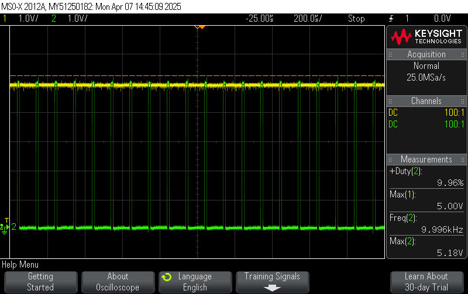
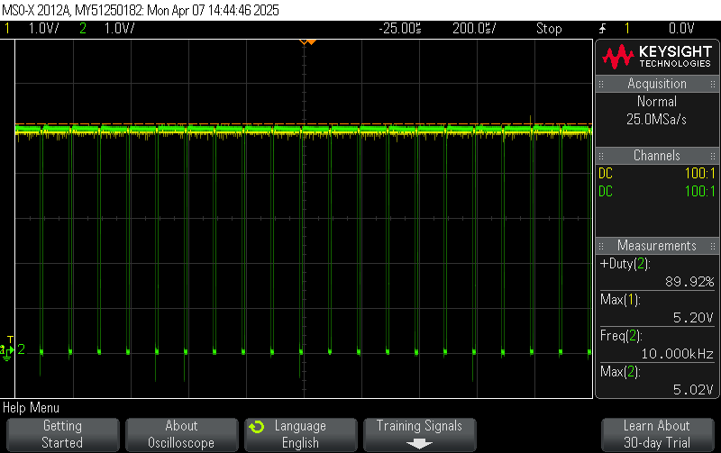

# 1. Input Circuit

1. Soldered **BR1, F1-F2, J1, R15-R16, R99** from the *Input* and test points for `PRI_GND` & `UNREG_DC`. Place 12A fuse.
   	- AC output on `UNREG_DC` with rocker switch OFF: No Output
   	- AC output on `UNREG_DC` with rocker switch ON:
	
2. Desoldered **BR1** and solder on **D1-D4** from the *Input*.
	- AC output on `UNREG_DC` with rocker switch OFF: No Output
	- AC output on `UNREG_DC` with rocker switch ON:
	
3. **BR1** vs **D1-D4** results: **D1-D4** had a lower voltage drop compared to **BR1**. Will continue with **D1-D4** for future testing.

4. Tested AC input waveform.
	

5. Soldered on **C9-C11** from the *Input*.
6. Tested the filtered input:
	- AC output on `UNREG_DC`: 33.8V DC output, less than 0.5% ripple.
	
	- Capacitor discharged to 0V after 60 seconds after rocker switch is OFF.

# 2. Independent Channel A 
## Channel A LVDD
1. This is to test the `A_5V` & `A_3V3` rail.
2. Soldered on **C1, C3, C4, C5, C12, D41, L1, L5, R94, U2** from the *LVDD* and test points for `A_GND`, `A_5V`.
3. Checked the `A_5V` rail.
	- DC output on `A_5V` had ringing noise at a frequency of 42 kHz.
  	
  	- 5V red LED turned on.
	- Ignoring the ringing, the `A_5V` net has a max of 4.99V and a min 4.91V
  	
	- `PRI_GND` & `A_GND` are isolated (using a voltmeter, ohmmeter, and continuity check).
4. Soldered on **C2, C6, D40, U1, R93** & test point for `A_3V3` from the *LVDD*.
5. Checked the `A_5V` rail again.
   	- DC output on `A_5V` had an average output of 4.87V. The ringing was reduced with the **C2** capacitor.
   	  
7. Checked the `A_3V3` rail.
	- DC output on `A_3V3` had an average output of 3.17V.
	- 3V3 yellow LED turned on.
	

## Channel A ESP32
1. Tested the ESP32 powers on. 
2. Soldered on **J7, J8**.
3. Placed the ESP32 on the board.
	- LED on the ESP32 turned on.
4. Soldered on **Q5, Q7, R17, R18** and test points `BUCK_A_nPWM`, `BUCK_A_PWM`, & `OUT_A_LV`.
5. Determined the accuracy of PWM duty cycle & logical level shift voltage levels.
	- Ran the Channel_A_ESP32_PWM.cpp file.
		- The PWM was set to 10kHz with a 10% duty cycle. `BUCK_A_PWM` showed exactly 10% and `BUCK_A_nPWM` had 90%. The PWM from the ESP32 has an accurate duty cycle.
		
			- Logical level shifts between `A_GND` & `A_5V` for `BUCK_A_PWM` and`BUCK_A_nPWM`.
   		 	
     			
     
		- Test was only run for 10kHz.

## Channel A External Connections Part 1
1. This is testing the input button & LCD screen for Channel A.
2. Solder on external JST connectors, **R5 & R7** for Channel A labelled **LCD_A, BUTTON_A**.
3. Test to make sure these connections work.
	- Run the Channel_A_Ext_Conn_1.cpp file.
		- Check to make sure the input from Button A is read properly on the LCD screen.

## Channel A Temperature Sensor
1. This is to test the temperature sensor.
2. Solder on **C37, R46, R47, U7**.
3. Solder on $50k\Omega$ for **R54**.
	- Run the Channel_A_Temp_Sense.cpp file.
		- Make sure the temperature sensor sends HIGH to *A_TMP_SNSE* at room temperature with this displayed on the LCD.
		- Make sure the temperature sensor sends a LOW signal with hot air gun at $55^{\circ}C$ (can set it up to $65^{\circ}C$) aimed at the temperature sensor and this is displayed on the LCD.
			- The temperature sensor should go off at around $53^{\circ}C$.
4. Determine what an appropriate resistor value for **R54** is to determine a temperature cut off.
	- Few choices here. Recommend using a lower temperature threshold first before moving onto higher threshold. Note this resistor value (will be used for Channel B later on).
		- $50k\Omega$ for $53^\circ C$ threshold
		- $30k\Omega$ for $79^{\circ}C$ threshold
		- $15k\Omega$ for $100^{\circ}C$ threshold

## Channel A Transformers
1. This is to test the flyback & feedback transformer.
2. Solder on **C24, C25, C26, Q29, Q35, Q38, Q39, R61, R70, R101, T2, T4** and test points `FLY_OUT_A`, `PRI_FET_A` & `SEC_FET_A`.
3. Check the flyback transformer outputs VDC at `FLY_OUT_A`.
	- Run the Channel_A_Transformer1.cpp file.
		- With the MCU, send a fixed PWM at 10kHz with a duty cycle of 25% on *A_DRIVE* and record the VDC at `FLY_OUT_A` (should be approximately 10.9V $\pm$ 2V) & record how long it takes for the output to settle (call this *transformer settle time*).
			- ***MAKE SURE THE DUTY CYCLE IS BELOW 50% ALWAYS!!!***
			- Verify the frequency used has the expected VDC output, if not, repeat with a different frequency in increasing order of 10kHz.
				- Feel free to test in smaller increments like 5kHz, 1kHz, or 500Hz, but nothing smaller than 500Hz.
				- ***DO NOT GO ABOVE 50kHz!***
		- Verify one last time that `PRI_GND` and `A_GND` are isolated from each other (using an ohmmeter).
		- Check capacitor voltage is 0V after the rocker switch is OFF after the ***universal wait time***. 
		- If the ripple is above 50mV, change the **C24, C25, C26** to a higher capacitance after ***universal wait time*** and redo step 3.
4. Determine the duty cycle needed for 10V, 12V, 20V at `FLY_OUT_A`.
	- Edit and run the Channel_A_Transform1.cpp file.
		- Based on the previous step, determine at what duty cycle 10V, 12V, and 20V occurs at. Record these values as *minimum duty cycle*, *LV duty cycle*, & *maximum duty cycle*. 
5. Record PWM duty cycle vs. VDC output.
	- Run the Channel_A_Transformer2.cpp file.
		- Measure the output voltage, `FLY_OUT_A`, with the duty cycle sweeping across from *minimum duty cycle* & *maximum duty cycle* in the *percent accuracy* increments so the total interval is 50 seconds.
			- To measure the full sweeping waveform: 
				- Set the horizontal time div to 5s per block.
				- Use the trigger function so the entire waveform is captured in a 50 second window.
				- Measure each voltage by zooming into the horizontal waveform for each block or using a cursor.
				- This procedure will be used multiple times and will be referred to as a *sweep measurement*.
			- If duty cycle to voltage is nonlinear, use a line of best fit to estimate.
		- Some extra notes
			- The flyback transformer is expected to output 20V to 10V in normal operation. 
			- The 12V number will be used for LV circuit and WON'T change.
			- These ***won't*** be the final numbers for the min and max duty cycle for Channel A and PWM duty cycle, since there will be a voltage drop (i.e. there's a diode in line to prevent reverse polarity). 
